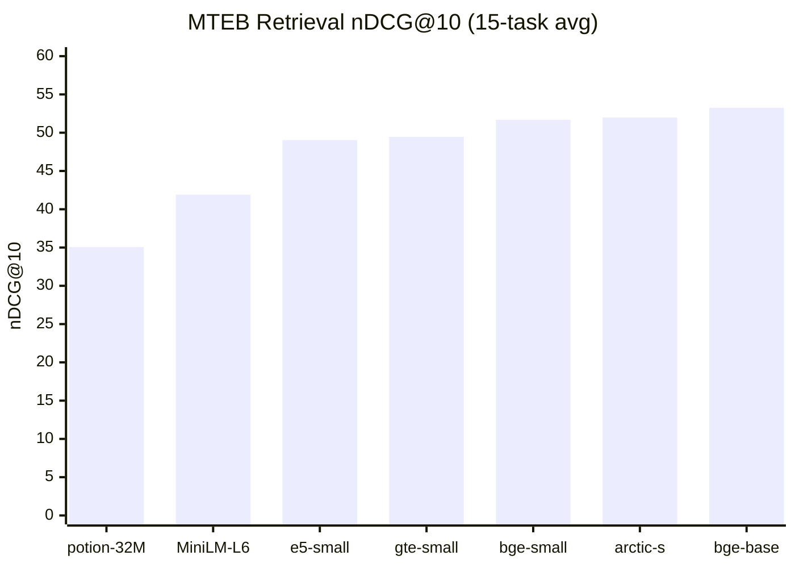
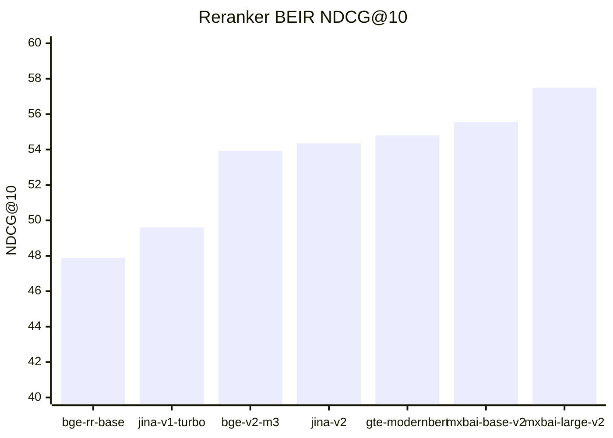

# 0002 — Embedding model & AMD RDNA / CPU acceleration

## Status: Accepted (2026-07-02)

Supersedes the embedding/serving portions of PRD decisions **DR-2** (CPU-only for v1) and **DR-3** (CPU HTTP sidecar) by re-examining them against the developer's actual hardware. Those decisions stand; this ADR records *why* they stand and what the one credible acceleration alternative is.

## Context — Engram's needs

Engram is a local-first, long-term memory service. The embedding pipeline is load-bearing in three ways that this ADR must reconcile:

- **Local-first / offline / private.** No per-call dependency on a hosted API; data does not leave the machine. This is a product posture, not a cost optimization.
- **The dim feeds a Neo4j native vector index.** Embedding dimension directly sets vector-index storage and query cost, and changing it later is a **full reindex**. Retrieval quality (precision@k) is the whole point of the eval, so dim and quality are coupled decisions, not independent knobs.
- **CPU HTTP sidecar (DR-3), no CUDA.** We currently run HF **Text Embeddings Inference (TEI)** serving `BAAI/bge-small-en-v1.5` (384-dim) on CPU. The dev box has an **AMD RDNA integrated GPU** — no NVIDIA, no CUDA. TEI also gives us a `/rerank` endpoint "for free," and we want a reranker that pairs cleanly with the embedder.

**Why revisit now.** Three questions were open: (1) is `bge-small` still the right embedder, or is there a better small model? (2) can we actually use the AMD iGPU to accelerate the sidecar, or is CPU genuinely the only option? (3) which reranker pairs best and on what runtime? The AMD-support landscape is full of overstated claims, so every acceleration claim below is pinned to a primary source and phrased at the confidence the source supports.

## Options considered

### (A) Embedding-model comparison

MTEB **Retrieval nDCG@10** is the 15-task average (the metric that matters for recall); "Overall" is the 56-task MTEB average. Scores mix MTEB versions across model cards — treat sub-1-point gaps as noise.

| Model | Dim | Params / size (fp32) | Retrieval nDCG@10 | Overall MTEB | License | ONNX / GGUF |
|---|---|---|---|---|---|---|
| all-MiniLM-L6-v2 | 384 | 22.7M / ~90 MB | ~41.9 | 56.3 | Apache-2.0 | ONNX ✅ / GGUF ✅ |
| e5-small-v2 | 384 | 33M / ~130 MB | 49.04 | 59.9 | MIT | ONNX ✅ / GGUF ⚠️ |
| gte-small | 384 | 33M / ~67 MB | 49.46 | 61.4 | MIT | ONNX ✅ / GGUF ⚠️ |
| **bge-small-en-v1.5 (current)** | **384** | **33.4M / ~130 MB** | **51.68** | **62.2** | **MIT** | **ONNX ✅ / GGUF ✅** |
| snowflake-arctic-embed-s | 384 | 33M / ~130 MB | 51.98 | ~55.9 | Apache-2.0 | ONNX ✅ / GGUF ⚠️ |
| bge-base-en-v1.5 | 768 | 109M / ~438 MB | 53.25 | 63.6 | MIT | ONNX ✅ / GGUF ✅ |
| nomic-embed-text-v1.5 | 768 (MRL 64–768) | 137M / ~550 MB | 53.25 | 62.3 | Apache-2.0 | ONNX ✅ / GGUF ✅ |
| arctic-embed-m-v1.5 | 768 (→128 B/vec) | 109M / ~440 MB | ~53 | — | Apache-2.0 | ONNX ✅ / GGUF ⚠️ |
| gte-base-en-v1.5 | 768 | 137M / ~440 MB | ~54 (8192 ctx) | — | Apache-2.0 | ONNX ✅ / GGUF ⚠️ |
| mxbai-embed-large-v1 | 1024 | 335M / ~670 MB | ~54.4 | 64.7 | Apache-2.0 | ONNX ✅ / GGUF ✅ |
| embeddinggemma-300m | 768 (MRL 512/256/128) | 308M / ~1.2 GB | — (MTEB-Eng-v2 **69.67**) | — | Gemma Terms (custom, not OSI) | ONNX ✅ / GGUF ⚠️ |
| potion-retrieval-32M (static) | 512 | ~32M / ~50–128 MB | 35.06 | ~49.7 | MIT | ONNX ✅ / GGUF ❌ |

Reading it: `bge-small` (51.68) beats `gte-small`, `e5-small`, and `all-MiniLM` while holding the index at **384 dims**. Only `arctic-embed-s` (51.98, Apache-2.0) meaningfully edges it at the same size/dim — the one lateral A/B worth running. Real quality jumps (`embeddinggemma-300m`, `gte-base`) are all **768-dim → double the index cost**; `arctic-embed-m-v1.5`'s 128-byte compression is the better lever if we ever want higher quality without paying full 768-dim storage. `potion-retrieval-32M` trades ~15 nDCG points for ~500× speed — only viable as a cheap first-stage feeding a reranker, never as the primary embedder for a memory service whose eval *is* recall quality.

### (B) AMD RDNA iGPU acceleration + serving matrix

The dev iGPU maps to a gfx target that AMD's official support **excludes**: RDNA2 680M/660M = `gfx1035`, RDNA3 780M/760M = `gfx1103`, RDNA3.5 890M/880M = `gfx1150` (Strix Halo 8060S = `gfx1151`). Support is granted per-gfx-target and *no consumer iGPU target is on the official ROCm list*.

| Path / runtime | Uses this AMD RDNA iGPU? | How (honest) | Cross-platform | Rerank? | Verdict |
|---|---|---|---|---|---|
| **ROCm (native HIP)** | **No — officially unsupported** | gfx1035/1103/1150 are absent from the ROCm system-requirements table ("if a GPU is not listed … it's not officially supported by AMD"). Runs **only unofficially, via Linux `HSA_OVERRIDE_GFX_VERSION`** + community/TheRock builds; the override **does nothing on Windows**. rocBLAS ships no gfx1103 kernels → llama.cpp #20839 crashes on warmup ("rocBLAS TensileLibrary … does not include gfx1103 support," HIP arch-1300 mismatch, memory-access fault). | Linux-only hack | via GGUF only | Unofficial / fragile / maintenance liability. Only **Strix Halo `gfx1151` is "Release-Ready" on Windows** via AMD's TheRock roadmap; RDNA2/RDNA3 iGPUs remain pre-release/community. |
| **Vulkan (llama.cpp / llama-server)** | **Yes** | Vulkan 1.2+ backend, vendor- and OS-agnostic; detects the 780M correctly (`uma:1, fp16:1`). Serves BGE from GGUF (`--embeddings --pooling cls`) and a cross-encoder (`--reranking`), OpenAI-style `/v1/embeddings`. | **Win + Linux, all RDNA gens** | **Yes** | **Most portable/reliable iGPU path.** iGPU is memory-bandwidth-bound on shared UMA RAM → gains over a good CPU baseline are **modest for single 384-dim queries; the win is batched throughput**. Not TEI-API-compatible → a **backend swap behind the ports**, not a config flag. |
| **DirectML (ONNX Runtime DML EP)** | **Yes — Windows only** | Runs on any DX12 GPU (AMD/Intel/NVIDIA/Qualcomm) incl. RDNA2 680M, no ROCm. BGE exports cleanly to ONNX. | Windows-only | DIY | Lowest-friction *Windows* GPU path, **but DirectML is in maintenance mode** (MS repo: "⚠️ DirectML is in maintenance mode ⚠️", new work moved to WinML); transformer perf uneven (ORT #20983); single-threaded per session; **no turnkey server** (you own the HTTP wrapper). Secondary Windows accelerator at best. |
| **HF TEI (current sidecar)** | **No** | TEI's only non-CPU path is **ROCm on Instinct MI200/MI300** ("AMD ROCm support is experimental. Only AMD Instinct GPUs … are tested"). No RDNA, no Vulkan, no DirectML. | — | Yes (`/rerank`) | On this box **TEI is CPU-only** — TEI-on-iGPU is not a real option. This means DR-3's "TEI on CPU" is the *only* TEI mode here, and framing the CPU choice as "we couldn't reach the iGPU from TEI" is accurate. |

Also ruled out as primary: **Ollama** (Vulkan works on iGPUs but there is **no native rerank endpoint** — cannot cover half the pipeline) and **Infinity** (feature-rich, but AMD acceleration is Instinct/discrete-only; degrades to CPU here with more overhead than TEI).

### (C) Performance vs running cost

**Local resource cost** (throughput figures are order-of-magnitude, hardware/batch-dependent):

| Model | Params / dim | Disk fp32 / int8 | RAM resident | CPU throughput (approx) |
|---|---|---|---|---|
| potion-base-8M (static) | 8M / 256 | ~8–30 MB / n/a | < 100 MB | **~20,000–25,000 sent/s** single-core |
| all-MiniLM-L6-v2 | 22M / 384 | 90 / 23 MB | < 1 GB | ~50 sent/s single-core; ~14k/s batched |
| gte-small | 33M / 384 | 67 / 17 MB | < 1 GB | ~bge-small class |
| **bge-small-en-v1.5 (current)** | 33.4M / 384 | 133 / 32 MB | < 1 GB | ~100–200 sent/s batched |
| nomic-embed-text-v1.5 | 137M / 768 | 274 / 70 MB | ~0.5–1 GB | ~20–30 ms/embed |
| bge-base-en-v1.5 | 109M / 768 | 438 / 110 MB | ~1 GB | slower |
| mxbai-embed-large-v1 | 335M / 1024 | 670 / 170 MB | ~1 GB+ | slowest here on CPU |

The realistic CPU lever is **INT8 quantization**, not a model swap: HF's Optimum-Intel benchmark reports **~4× throughput** (peak at batch 128) and **~4.5× latency** at batch 1, shrinking bge-small from 127 MB → ~32 MB. Accuracy cost is small but not zero: retrieval loss is **up to ~1.55%** in general (BGE-base −1.55%), and **−0.58% for bge-small specifically**. (Note: an earlier "5.25–9.3× throughput / <1% loss" figure did **not** hold against the primary source and is corrected here.) No citable AMD-iGPU embedding benchmark exists — iGPU speedups must be **measured locally**, not promised.

**Hosted-API reference ceiling** (per 1M input tokens — a *reference*, not a rival, since local-first is the point):

| API model | Provider | Dim | $/1M tokens | MTEB |
|---|---|---|---|---|
| text-embedding-3-small | OpenAI | 1536 (MRL) | $0.02 | 62.3 |
| text-embedding-3-large | OpenAI | 3072 (MRL) | $0.13 | 64.6 |
| embed v4 | Cohere | 1024 (MRL) | $0.12 | 66.3 |
| jina-embeddings-v3 | Jina AI | 1024 (MRL) | $0.02 | 65.5 |
| voyage-3-large | Voyage | 1024 | $0.18 | 67.1 |
| voyage-3-lite | Voyage | 512 | $0.02 | 61.4 |

Framing: even 100M tokens/month is **~$2/mo** at the cheapest and **~$18/mo** at the priciest. The dollar gap is trivial — the case for local is **privacy, offline operation, and no per-call dependency**, exactly Engram's posture. Hosted is a ceiling, not a competitor.

### (D) Reranker comparison

TEI serves **encoder** cross-encoders (BERT / RoBERTa / XLM-RoBERTa / ModernBERT / GTE) on the **same CPU sidecar** as the embedder. It does **not** serve **decoder-LLM** rerankers (mxbai-v2, bge-v2-gemma) — those need a second runtime (vLLM/Infinity). BEIR is NDCG@10; the A100 latency column is *relative only* — on CPU, param count is the real latency proxy.

| Reranker | Params / base | BEIR NDCG@10 | Serve on TEI (CPU)? | License | Rel. latency (A100) |
|---|---|---|---|---|---|
| ms-marco-MiniLM-L6-v2 | 22.7M / MiniLM-BERT | ~modest | ✅ | Apache-2.0 | fastest |
| jina-reranker-v1-turbo-en | 37.8M / 6-layer | 49.60 | ✅ | **CC-BY-NC-4.0 (non-commercial)** | very fast |
| **gte-reranker-modernbert-base** | 150M / ModernBERT | **54.8** | ✅ | Apache-2.0 | fast |
| bge-reranker-base | 278M / XLM-R-base | 47.89 | ✅ | MIT | medium |
| jina-reranker-v2-base-multilingual | 278M / XLM-R | 54.35 | ✅ | **CC-BY-NC-4.0** | medium |
| **bge-reranker-v2-m3** | 568M / bge-m3 | 53.94 | ✅ | Apache-2.0 | 3.05 s |
| mxbai-rerank-base-v2 | 0.5B / **Qwen-2.5 decoder** | **55.57** | ❌ (needs 2nd runtime) | Apache-2.0 | 0.67 s |
| mxbai-rerank-large-v2 | 1.5B / **Qwen-2.5 decoder** | **57.49** | ❌ | Apache-2.0 | 0.89 s |
| bge-reranker-v2-gemma | 2.5B / Gemma-2B decoder | 55.38 | ❌ | Gemma terms | 7.20 s |
| Cohere Rerank 3.5 | closed / API only | 55.39 | ❌ (not self-hostable) | Commercial API | n/a |

**Licensing gotcha:** the **Jina rerankers are CC-BY-NC-4.0** (non-commercial weights) — a poor fit for self-hosted, local-first. BGE (MIT/Apache-2.0), GTE (Apache-2.0), and mxbai (Apache-2.0) are clean. Cohere is not self-hostable and breaks local-first outright.

## Graphs

**1) Quality vs local resource cost (the money chart).** Normalized 0–1 (quality = MTEB mapped 50→0, 66→1; cost = local size + CPU latency, 0 = cheapest). Sweet spot = high quality + low cost (upper-left).

```mermaid
quadrantChart
    title Embedding quality vs local resource cost
    x-axis Low Cost --> High Cost
    y-axis Low Quality --> High Quality
    quadrant-1 Premium
    quadrant-2 sweet spot
    quadrant-3 Budget floor
    quadrant-4 Overpriced
    "bge-small-v1.5": [0.30, 0.77]
    "gte-small": [0.25, 0.71]
    "all-MiniLM-L6": [0.20, 0.37]
    "potion-8M": [0.02, 0.08]
    "nomic-v1.5": [0.60, 0.77]
    "mxbai-large": [1.00, 0.92]
```

`bge-small` and `gte-small` sit in the sweet-spot quadrant. `nomic` matches bge-small's quality at 2× the cost (only its 8k context justifies it); `mxbai-large` buys ~2.4 MTEB points for ~3× the cost; `potion` is the extreme cost-optimized corner.

**2) MTEB Retrieval nDCG@10 across candidate small models** (single track, 15-task avg — the recall metric):



`bge-small` (51.68) leads the 384-dim field; only `arctic-embed-s` (51.98) is within noise, and only `bge-base` (53.25) is clearly higher — at double the dim.

**3) Reranker quality (BEIR NDCG@10).** Encoder rerankers (TEI-servable) vs decoder rerankers (need a 2nd runtime):



`gte-reranker-modernbert-base` (54.8, 150M) visibly **dominates `bge-reranker-base`** (47.89, 278M) — smaller *and* better — and the decoder rerankers (mxbai) buy the top ~1–3 points only by leaving the TEI sidecar.

## Decision (recommendation)

1. **Embedding model: keep `BAAI/bge-small-en-v1.5` (384-dim, MIT).** It is already wired, is on the efficient frontier for its size (51.68 retrieval nDCG@10), holds the Neo4j index at 384 dims, and is MIT-clean. No candidate justifies a switch for v1; `snowflake-arctic-embed-s` (51.98, same size/dim, Apache-2.0) is the *only* lateral worth A/B-testing through the M5 precision@k gate before committing. Do **not** move to a 768-dim model (`embeddinggemma`, `gte-base`) in v1 — that doubles index cost and forces a reindex for a gain the eval hasn't yet proven necessary.

2. **Acceleration path: keep TEI-on-CPU as the default; make INT8 quantization the real lever; evaluate llama.cpp/Vulkan as the one iGPU challenger.** TEI has **no** path to this AMD RDNA iGPU (Instinct/ROCm only), so "CPU" is not a compromise against a TEI-iGPU option — that option does not exist. The highest-confidence speedup is **INT8 bge-small (~4× throughput, ≈−0.58% retrieval)**, fully inside DR-2/DR-3. The **only** credible iGPU accelerator is **llama.cpp/llama-server with the Vulkan backend** — cross-platform (Win + Linux), all RDNA generations, serving both embeddings and rerank from GGUF, **unofficial ROCm/`HSA_OVERRIDE` explicitly avoided**. It is a **backend swap behind the `Embedder`/`Reranker` ports, not a TEI flag**, and its gains are batched-throughput, memory-bandwidth-bound, and **must be measured locally** before we bank on them. DirectML is a Windows-only, maintenance-mode fallback; ROCm on 680M/780M/890M is rejected as fragile and unofficial (only Strix Halo `gfx1151` approaches first-class support).

3. **Reranker: ship `BAAI/bge-reranker-v2-m3` (primary), benchmark `Alibaba-NLP/gte-reranker-modernbert-base` as the efficiency challenger.** The primary is same-BGE-family, Apache-2.0, and **runs on the existing TEI CPU sidecar via `/rerank` — zero new runtime**, one process for `/embed` + `/rerank`, fully inside DR-3. Its only cost is being the heaviest encoder (568M) on CPU; if p95 over a short candidate list (k ≤ 50–100) is unacceptable, the ModernBERT challenger is ~¼ the params, TEI-servable, and posts a *higher* single-number BEIR (54.8) — likely the best quality-per-CPU-millisecond and a strong bet to win the M5 eval. The decoder-LLM ceiling (`mxbai-rerank-base-v2`, 55.57) is adopted **only** if the eval shows a decisive precision@k lift worth standing up a second runtime. Reject the Jina rerankers (CC-BY-NC) and Cohere (not self-hostable).

**Impact on prior decisions:** DR-3 (CPU HTTP sidecar) is **reaffirmed**, not changed — TEI-on-CPU remains the default and now also carries the reranker. The **vector-index dim stays 384**, so no reindex. If a future ADR adopts a 768-dim embedder, that is a deliberate reindex event, called out below.

## Consequences

**Stays the same:** embedder (`bge-small`, 384-dim), Neo4j vector-index dimension (384 → **no reindex**), TEI CPU sidecar, and the local-first/offline posture. The reranker rides the existing sidecar.

**Changes / new work:**
- Add an **INT8-quantized bge-small** artifact to the sidecar path (~4× CPU throughput; validate the ≈−0.58% retrieval delta against the eval before enabling by default).
- Keep the `Embedder`/`Reranker` ports strict enough that **llama.cpp/Vulkan is a drop-in adapter**, so the iGPU path is a wiring change in `main()`, never a domain change.
- **Reranker lands at M3** behind the `Reranker` port (`bge-reranker-v2-m3` on TEI). Wire `gte-reranker-modernbert-base` (and optionally `mxbai-rerank-base-v2` on a second runtime) as alternates.
- **The M5 eval gate selects both the embedder A/B (`bge-small` vs `arctic-embed-s`) and the reranker** on measured precision@k **plus p50/p95 CPU latency** emitted from `cmd/eval` — anti-circular, real Engram numbers.
- **Benchmark obligation:** no public AMD-iGPU embedding numbers exist. Before promising any iGPU speedup, the harness must produce **TEI-CPU vs llama.cpp-CPU vs llama.cpp-Vulkan-iGPU** throughput and p50/p95 at batch 1 and 32 on the target box.

**Migration cost:** the expensive, deferred event is a **dim change (384 → 768)** for `embeddinggemma`/`gte-base` — that is a full Neo4j vector-index **reindex** and a new ADR, taken only if the eval shows the quality jump earns its doubled index cost. Everything recommended here avoids that.

**Risks accepted:** INT8's small retrieval loss (gated by the eval); GGUF reranker quality has had sharp edges historically (must be verified against the TEI/HF reference before trusting a Vulkan-served reranker); iGPU gains may prove marginal for single-query latency (that is why Vulkan is a *challenger*, not the default).

## Sources

- bge-small: https://huggingface.co/BAAI/bge-small-en-v1.5 · ONNX sizes: https://huggingface.co/onnx-community/bge-small-en-v1.5-ONNX
- embeddinggemma: https://huggingface.co/google/embeddinggemma-300m · gte-base: https://huggingface.co/Alibaba-NLP/gte-base-en-v1.5 · arctic-embed-s: https://huggingface.co/Snowflake/snowflake-arctic-embed-s · potion: https://huggingface.co/minishlab/potion-retrieval-32M
- ROCm system requirements (no consumer iGPU): https://rocm.docs.amd.com/projects/install-on-linux/en/latest/reference/system-requirements.html
- TheRock supported-GPU roadmap (gfx1151 Windows Release-Ready): https://github.com/ROCm/TheRock/blob/main/SUPPORTED_GPUS.md
- llama.cpp gfx1103 rocBLAS crash (#20839): https://github.com/ggml-org/llama.cpp/issues/20839 · Vulkan on AMD iGPU: https://github.com/ggml-org/llama.cpp/discussions/10879 · embeddings/rerank server README: https://github.com/ggml-org/llama.cpp/blob/master/tools/server/README.md
- TEI on AMD/ROCm (Instinct-only, experimental): https://huggingface.co/docs/text-embeddings-inference/en/amd_gpu
- DirectML maintenance mode: https://github.com/microsoft/DirectML · ORT DirectML EP: https://onnxruntime.ai/docs/execution-providers/DirectML-ExecutionProvider.html · ORT transformer perf (#20983): https://github.com/microsoft/onnxruntime/issues/20983
- Ollama no rerank endpoint (#10467): https://github.com/ollama/ollama/issues/10467 · experimental Vulkan: https://www.phoronix.com/news/ollama-Experimental-Vulkan
- INT8 CPU acceleration (~4× throughput, ~4.5× latency, retrieval loss up to ~1.55%): https://huggingface.co/blog/intel-fast-embedding
- Rerankers: https://huggingface.co/BAAI/bge-reranker-v2-m3 · https://huggingface.co/BAAI/bge-reranker-base · https://huggingface.co/Alibaba-NLP/gte-reranker-modernbert-base · mxbai-v2 BEIR + latency: https://www.mixedbread.com/blog/mxbai-rerank-v2 · Jina CC-BY-NC license: https://huggingface.co/jinaai/jina-reranker-v2-base-multilingual · SBERT cross-encoders: https://sbert.net/docs/cross_encoder/pretrained_models.html
- Hosted pricing: https://developers.openai.com/api/docs/models/text-embedding-3-small · https://docs.cohere.com/docs/how-does-cohere-pricing-work · https://jina.ai/embeddings/
